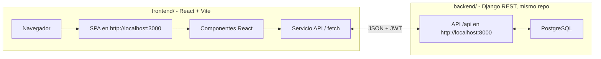

# TP5 - Bosquejo del diseno (Home / estructura general)

> Diagrama inicial del frontend React. Es una guia de componentes y flujos, no un contrato cerrado: puede ajustarse en TPs siguientes.

## 1. Arquitectura general (dos capas)



- El frontend **no** renderiza HTML desde Django: consume JSON de la API.
- Autenticacion con JWT ya existente en el backend (login/refresh/logout/register).

## 2. Vista general (estructura de componentes)

```mermaid
flowchart TD
    App[App - rutas y estado de sesion]
    Footer[Footer]

    App --> Navbar[Navbar]
    App --> Home[Home]
    App --> AuthPage[AuthPage]
    App --> StoreDetail[StoreDetail]
    App --> Carrito[Cart]
    App --> Profile[Profile]
    App --> Footer

    Navbar --> Logo[Logo FoodRush]
    Navbar --> Search[Buscar productos/tiendas]
    Navbar --> AuthMenu[AuthMenu]

    AuthMenu --> NoSesion[(sin sesion: Login | Registrarse)]
    AuthMenu --> ConSesion[(con sesion: Mi Perfil | Carrito | Cerrar sesion)]

    Home --> Hero[Hero]
    Home --> StoreList[StoreList]
    Home --> Featured[FeaturedProducts]

    StoreList --> StoreCard[StoreCard xN]
    Featured --> ProductCard[ProductCard xN]
    StoreDetail --> ProductCard
    Carrito --> CartItem[CartItem xN]

    Profile --> ProfileInfo[ProfileInfo]
    Profile --> OrderHistory[Historial de pedidos]
```

## 3. Componentes clave

| Componente | Responsabilidad |
| --- | --- |
| `App` | Enrutado base y estado global de sesion (usuario autenticado, rol, token) |
| `Navbar` | Navegacion fija superior. Muestra menu segun sesion (usa estado de auth global) |
| `Hero` | Encabezado con la marca y mensaje principal |
| `StoreList` | Lista de tiendas desde `GET /api/stores/` |
| `StoreCard` | Imagen, nombre, categoria; boton al detalle de la tienda |
| `ProductCard` | Imagen, nombre, precio, tienda, stock; boton "Agregar" solo si stock > 0. Reusable en catalogo/tienda/dashboard |
| `Cart` | Lista de `CartItem` con cantidades, total y boton confirmar pedido |
| `AuthPage` | Formularios login (`POST /api/token/`) y registro (`POST /api/register/`) |
| `Profile` | Perfil (`GET /api/profile/`) y historial de pedidos |

## 4. Rutas pensadas (client-side)

| Ruta | Vista | Componente principal |
| :--- | :--- | :--- |
| `/` | Home con tiendas y productos | `Home` |
| `/tiendas/:id` | Tienda con sus productos | `StoreDetail` |
| `/carrito` | Carrito del usuario | `Cart` |
| `/login` `/registro` | Autenticacion | `AuthPage` |
| `/perfil` | Datos del usuario y sus pedidos | `Profile` |

## 5. Flujo de navegacion principal

```
[Home (lista de tiendas y productos)]  →  [Detalle de tienda (sus productos)]
                                             ↓ agregar al carrito
      [Carrito]  →  [Confirmar pedido]  →  [Historial de pedidos / Perfil]
```

1. Usuario entra → Home (Hero + lista de tiendas).
2. Sin sesion: puede ver tiendas/productos y usar Login o Register.
3. Con sesion `cliente`: puede agregar al carrito y ver su carrito.
4. Con sesion `vendedor`: puede crear tienda y productos desde su dashboard.
5. `admin`: acceso de gestion (a definir en TPs posteriores).

## 6. Flujo de datos (frontend <-> API)

* El token JWT se guarda en `localStorage` (o `sessionStorage`) tras el login.
* Los llamados a la API usan `Authorization: Bearer <token JWT>`.
* El estado de autenticacion se maneja con contexto de React (`AuthContext`).
* Los llamados a la API viven en servicios separados (`src/api/`), no dentro de los componentes.

## 7. Estado del andamiaje (TP5)

- [x] Proyecto Vite + React en `frontend/`
- [x] `vite.config.js` con `server.port = 3000`
- [x] `npm run dev` verificado en `http://localhost:3000` (HTTP 200)
- [x] `docs/diagrama.md` versionado

## Pendiente (para TPs siguientes)

- [ ] Instalar `react-router-dom` para las rutas client-side
- [ ] Crear `src/api/` con los servicios del backend
- [ ] Contexto de autenticacion (`AuthContext`)
- [ ] Maquetado de la Home consumiendo los endpoints reales