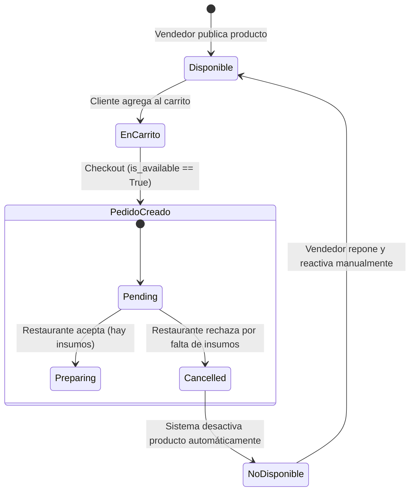
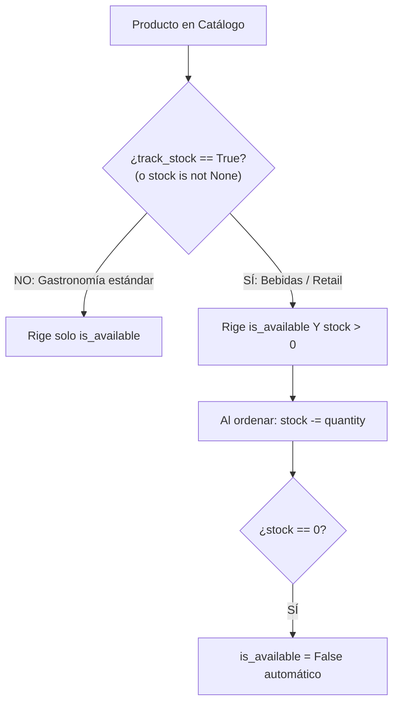

# Propuesta Arquitectónica: Gestión de Disponibilidad Gastronómica y Stock Híbrido

## Resumen
Analizar y diseñar una estrategia de **disponibilidad orientada a gastronomía** para el marketplace FoodRush. En negocios gastronómicos (restaurantes, rotiserías, cafeterías), el stock numérico estricto por plato terminado no refleja la operación real (la cocina produce bajo demanda según ingredientes e insumos variables). 

La propuesta sustituye la exigencia de stock numérico obligatorio por un modelo de **Disponibilidad Booleana (`is_available`)** con **desactivación reactiva ante rechazo de pedidos por falta de ingredientes**, manteniendo un camino de compatibilidad hacia adelante para permitir stock numérico opcional (e.g. bebidas enlatadas o platos limitados) en el futuro.



---

## Análisis de Conveniencia y Comparativa

| Criterio | Stock Numérico Estricto (Actual) | Disponibilidad Booleana + Desactivación Reactiva (Propuesta) |
| :--- | :--- | :--- |
| **Alineación con la Cocina** | Pobre. Un restaurante no sabe cuántas hamburguesas tiene sin contar el pan, la carne picada y el queso. | Excelente. El cocinero simplemente declara qué platos puede preparar hoy. |
| **Fricción del Vendedor** | Alta. El vendedor debe reponer números constantemente en el sistema. | Mínima. Switch "Disponible / Pausado" desde el panel. |
| **Manejo de Quiebre de Stock** | Rígido. Si el stock dice 5 pero se cayó la última bandeja al piso, no hay flujo natural de rechazo. | Flexible. El restaurante rechaza el pedido, indica el motivo y el plato se pausa automáticamente. |
| **Soporte para Retail/Bebidas** | Bueno para latas y botellas con inventario físico fijo. | Requiere soporte híbrido (ver estrategia evolutiva más abajo). |

---

## Dinámica con el Carrito y Pedidos Simultáneos

### 1. Agregar al Carrito
- Si `product.is_available == False`, `CartService.add_item_to_cart` rechaza inmediatamente con `400 Bad Request` (*"Este producto no se encuentra disponible actualmente"*).

### 2. Carritos Abiertos con Productos que Pasan a "No Disponible"
- **Escenario:** El cliente A tiene una hamburguesa en su carrito a las 20:00. A las 20:10 el restaurante pausa la hamburguesa porque se quedó sin pan. A las 20:15 el cliente A presiona "Confirmar pedido".
- **Comportamiento recomendado:**
  - Al iniciar el checkout, el sistema valida la disponibilidad de todos los ítems del carrito.
  - Si algún producto está pausado, se bloquea la creación del pedido y se responde:
    ```json
    {
      "error": "PRODUCT_UNAVAILABLE",
      "detail": "El producto 'Hamburguesa Doble' se agotó recientemente. Por favor, elimínalo de tu carrito para continuar.",
      "unavailable_product_ids": [14]
    }
    ```

### 3. Pedidos Simultáneos (Race Conditions)
- **Escenario:** Dos clientes compran el último postre al mismo segundo (20:00:01 y 20:00:02). Ambos pedidos ingresan en estado `pending`.
- **Resolución:**
  1. El restaurante acepta el Pedido 1 (`preparing`).
  2. Al ver el Pedido 2, la cocina advierte que ya no queda porción.
  3. El restaurante rechaza el Pedido 2 con motivo *"Falta de insumos / Producto agotado"*, seleccionando el producto causante.
  4. La API realiza atómicamente:
     - Cancela el Pedido 2 (`status = 'cancelled'`).
     - Almacena el motivo en el pedido (`cancellation_reason = 'Sin stock del producto: Volcán de Chocolate'`).
     - Actualiza el producto: `product.is_available = False`.
  5. Ningún otro cliente podrá agregar ese postre hasta que el vendedor vuelva a habilitarlo.

---

## Estrategia Evolutiva: ¿Cómo permitir Stock Numérico a futuro sin rehacer el código?

Para que esta decisión no sea excluyente ni obligue a reescribir la base de datos más adelante, proponemos el **Patrón de Stock Híbrido Opcional**:



1. **Atributo `track_stock` (o `stock` nullable):**
   - Si `stock` es `None` (o `track_stock = False`): el producto es de elaboración gastronómica; no se controla cantidad máxima física, solo el switch `is_available`.
   - Si `stock` es un entero $\ge 0$ (o `track_stock = True`): el producto tiene inventario numérico (e.g. cervezas artesanales en lata). Se valida cantidad y se descuenta unidad por unidad. Si llega a 0, pasa automáticamente a `is_available = False`.
2. **Ventaja:**
   - La arquitectura actual ya posee `is_available` y `stock` en el modelo `Product`. Basta con definir que el stock sea opcional (`null=True, blank=True`) o que un stock de `None` / `0 con flag` no bloquee la compra si `is_available = True`.

---

## Cambios Requeridos en la Arquitectura Actual

### A. Modelo de Datos (`core/models.py`)
1. **`Product`:**
   - Permitir `stock = models.PositiveIntegerField(null=True, blank=True, default=None)` o agregar `track_stock = models.BooleanField(default=False)`.
2. **`Order`:**
   - Agregar campos de trazabilidad de cancelación:
     ```python
     cancellation_reason = models.CharField(max_length=255, blank=True, null=True, verbose_name="motivo de cancelacion")
     cancelled_product = models.ForeignKey(Product, null=True, blank=True, on_delete=models.SET_NULL, related_name="cancelled_orders")
     ```

### B. Capa de Servicios (`core/services/`)
1. **`CartService`:**
   - Validar `product.is_available`.
   - Si `product.track_stock` es `True`, validar `product.stock >= quantity`. Si es `False`, permitir la cantidad solicitada sin trabar por stock numérico ficticio.
2. **`OrderService`:**
   - Incorporar método `reject_order_by_vendor(order, vendor_user, reason, out_of_stock_product=None)`:
     - Cambia estado a `CANCELLED`.
     - Guarda `cancellation_reason`.
     - Si se especificó `out_of_stock_product`, ejecuta `out_of_stock_product.is_available = False; out_of_stock_product.save(update_fields=['is_available'])`.

### C. Endpoints de la API
- Endpoint de actualización rápida de disponibilidad para vendedores:
  `PATCH /api/products/{id}/` con payload `{ "is_available": false }`.
- Acción de cancelación de pedido con motivo para vendedores:
  `PATCH /api/orders/{id}/` con payload `{ "status": "cancelled", "cancellation_reason": "Sin stock", "out_of_stock_product": 5 }`.

---

## Ventajas y Desventajas del Enfoque

### Ventajas:
1. **Fidelidad al Dominio:** Modela la realidad operativa de bares, cocinas y pizzerías.
2. **Simplicidad de Uso:** Un vendedor simplemente enciende o apaga el plato con un clic.
3. **Automatización:** Si una orden es rechazada por falta de ingredientes, el producto se apaga solo, evitando que otros clientes cometan el mismo error y se frustren.
4. **Escalabilidad:** Permite activar control de inventario estricto en el futuro solo para las tiendas o productos que lo necesiten.

### Desventajas / Puntos de Atención:
1. **Riesgo de Pedidos Excesivos en Picos de Demanda:** Si un plato no tiene límite numérico, un cliente podría pedir 50 hamburguesas en una sola orden.
   - *Mitigación:* Limitar una cantidad máxima por ítem en el carrito (ej. máx. 10 unidades por producto) o regla por tienda.
2. **Dependencia de la Reactividad del Vendedor:** Si el vendedor olvida reactivar el producto al día siguiente cuando compró ingredientes, el producto queda pausado.
   - *Mitigación (futura):* Botón de recordatorio diario o resumen matutino de "Productos pausados".

---

## Pasos de Implementación Recomendados (Cuando se decida aplicar)

1. **Paso 1 (Backend - Migración de Modelos):**
   - Agregar `cancellation_reason` y `cancelled_product` a `Order`.
   - Hacer `stock` opcional en `Product` con flag `track_stock = False` por defecto.
2. **Paso 2 (Backend - Lógica en Servicios):**
   - Actualizar `CartService` para evaluar stock solo si `track_stock == True`.
   - Extender `OrderService` con la lógica transaccional de rechazo justificado y apagado automático de producto.
3. **Paso 3 (TDD - Pruebas Automatizadas):**
   - Escribir tests en `core/tests.py` validando el flujo completo: creación de pedido -> rechazo por falta de insumo -> verificación de `is_available == False` en el producto -> intento posterior de otro cliente bloqueado con `400 Bad Request`.
4. **Paso 4 (Frontend - Futuro TP de Vendedor):**
   - Incorporar switch toggle "Disponible" en la vista del vendedor y modal de cancelación con motivo al rechazar un pedido.
